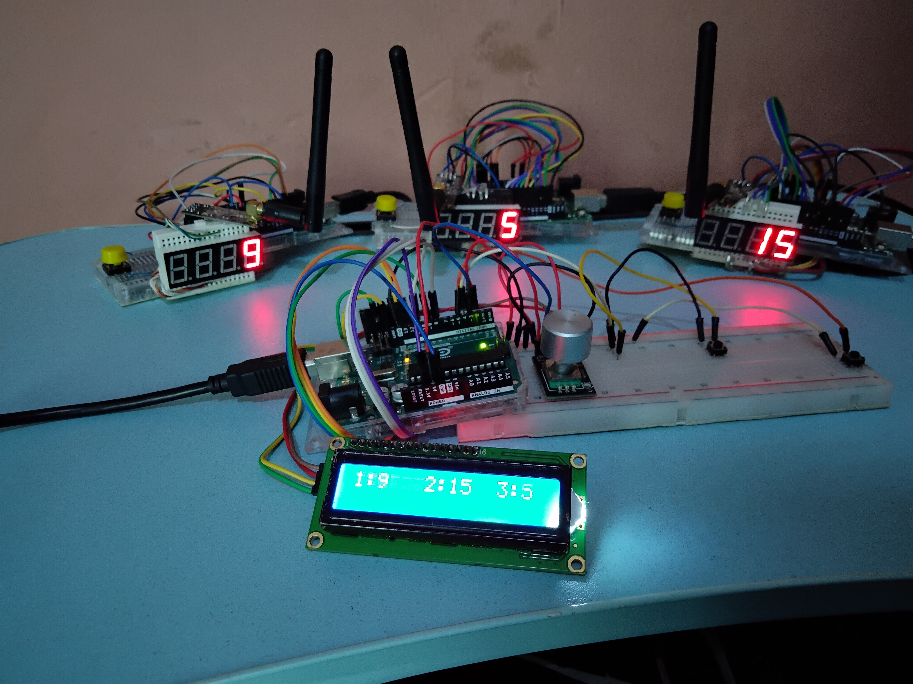

<!--
  * add a proper demo video
  * Create links to hardware and software
  * Add about me section

-->

# Arduino Quiz Buzzer and Score Keeping System
  
  The Arduino Quiz Buzzer and Score Keeping System is a wireless buzzer system designed for quiz and trivia games. This prototype consists of one master unit and three slave units, with room for more slaves.
  The master unit keeps track of individual scores and allows a user to enter scores for the contestants and update the slave's scores.
  This project is perfect for quizzes involving speed where the first contestant(s) to buzz in needs to be determined.

## Technical Specifications
### Hardware
  * Arduino UNO (1 for master and 3 for slave units)
  * nRF24L01 transceiver modules (4 units for master and slaves)
  * LCD screens (1 units for master)
  * 2 or 3 digit seven segment display (3 units for slaves)
  * Rotary encoder (1 unit for master)
  * Push buttons (5 units for master and slaves)
  * Breadboards (4 units for master and slaves)
  * Jumper wires

### Software
  * [Arduino IDE](https://www.arduino.cc/en/software)

## Project Overview and Functionality
  The Arduino Quiz Buzzer and Score Keeping System is a project designed to add an interactive element to any quiz or trivia event. The system is composed of a master Arduino board, which acts as the central controller, and multiple slave boards, which are connected to quiz buzzer buttons.

  When a player buzzes in on their buzzer button, the corresponding slave board sends a signal to the master board, which keeps track of the order in which the players buzzed in. The master board then allows for score enntry of the player who has the current turn.

  The system is very versatile and can be used for a wide range of quiz formats, from simple multiple-choice questions to more complex formats, such as those involving speed races, buzz-in answers or timed responses. The system can be expanded easily by adding more slave boards to accommodate additional players or teams.
  
  The communication between the slave and the master is wireless, achieved using nRF24L01 transceiver modules. This module allows for reliable and efficient data transfer, making the entire system easy to set up and use. With this wireless communication.
  
  Using wireless communication provides several advantages over wired communication. Firstly, it eliminates the need for physical cables, reducing the cost and complexity of the system. Additionally, it allows for greater flexibility in system design, as components can be placed in any location without the constraint of cable length. Wireless communication also reduces the risk of cable damage or failure, which can be a common issue in wired systems. Overall, wireless communication with nRF24L01 modules provides a reliable, cost-effective, and flexible solution for communication between the master and slave components of the Arduino Quiz Buzzer and Score Keeping System.

  Overall, the Arduino Quiz Buzzer and Score Keeping System is a fun and interactive way to add some excitement to any quiz or trivia event. Whether you're hosting a school competition or a family game night, this system is sure to keep players engaged and entertained.

## Demo and Practical Use Videos
  Check out the following videos to see the project in action:
  * [Demo Video](https://youtu.be/OUE3yYNOI4o): This video provides an overview of the project and shows how it works.
  * [Practical Use Video 1](https://youtu.be/ulLWXXdCyck): This video shows the project being used in a real-world scenario, highlighting its practical applications.
  * [Practical Use Video 2](https://youtu.be/WYW6d2NBO70): This video also shows the project being used in a real-world scenario.

## Contributions
Contributions are always welcome! If you have any ideas for improving the project, please submit a pull request or open an issue.
